# CA Unified Infrastructure Manager

The xMatters probe is set to sit on your UIM message bus and listen for any message with a subject of "xmatters".

When a event with a subject of "xmatters" is found, the xmatters probe will execute the xmattersgtw.jar file and POST UIM fields over to an inbound integration in the xMatters communication pan.

The xMatters communication plan has outbound integration for Event Status and Response. The outbound integration points to the xMatters Integration Agent which updates UIM tickets.


# Pre-Requisites
## For base integration
* Nimsoft UIM version 8.4
* xMatters Integration Agent - Download [here](https://support.xmatters.com/hc/en-us/articles/201463419-Integration-Agent-for-xMatters-5-x-xMatters-On-Demand)
* xMatters account - If you don't have one, [get one](https://www.xmatters.com)!

## For customizing the integration
* [Java SE Development Kit](http://www.oracle.com/technetwork/java/javase/downloads/jdk8-downloads-2133151.html)
* [Eclipse IDE for Java Developers](http://www.eclipse.org/downloads/packages/eclipse-ide-java-developers/neon3)
* [Winzip](http://www.winzip.com/), [Unarchiver](http://unarchiver.c3.cx/unarchiver), or another application capable of extracting a Jar File.
* [UIM Help Documents](https://docops.ca.com/ca-unified-infrastructure-management/8-5-1/en)
* [UIM Probes Help Documents](https://docops.ca.com/ca-unified-infrastructure-management-probes/ga/en)


# Files
* [xmattersgtw_1.14.zip](xmattersgtw_1.14.zip) - xMatters UIM Probe 
* [xmattersgtw-Eclise-Archive.zip](xmattersgtw-Eclise-Archive.zip) - xMatters Eclipse Project
* [UIMNimsoft-xMatters-Comm-Plan.zip](UIMNimsoft-xMatters-Comm-Plan.zip) - xMatters UIM Nimsoft Communication Plan
* [UIM-xMatters-Integration-Service.zip](UIM-xMatters-Integration-Service.zip) - UIM Integration Service for Integration Agent


# How it works
The xMatters probe is set to sit on your UIM message bus and listen for any message with a subject of "xmatters".

When a event with a subject of "xmatters" is found, the xmatters probe will execute the xmattersgtw.jar file and POST UIM fields over to an inbound integration in the xMatters communication pan.

The xMatters communication plan has outbound integration for Event Status and Response. The outbound integration points to the xMatters Integration Agent which updates UIM tickets.

## Default UIM Fields passed to xMatters

The out of the Box properties that UIM will send to xMatters are as follows:

*UIM Property List:*

* subject
* alarmSev
* hostname
* subsystem
* robot
* probe
* message
* timeReceived
* timeArrived
* alarmCount
* alarmID
* alarm_source
* UserTag1
* UserTag2
* Custom_1
* Custom_2
* Custom_3
* Custom_4
* Custom_5


# Installation
These are instructions for installing the base integration. For details on customizing the integration, see [below]()

## UIM Setup
### Add xmattersgtw_1.14.zip to the archive

Whether you have customized a java file and created a new jar file or not you will need to do this step. 
You will be able to add your a customized jar file to the package after it is added to the archive.

1. Go into Archive
2. Right click anywhere in the archive and go to Import 

<kbd> 
	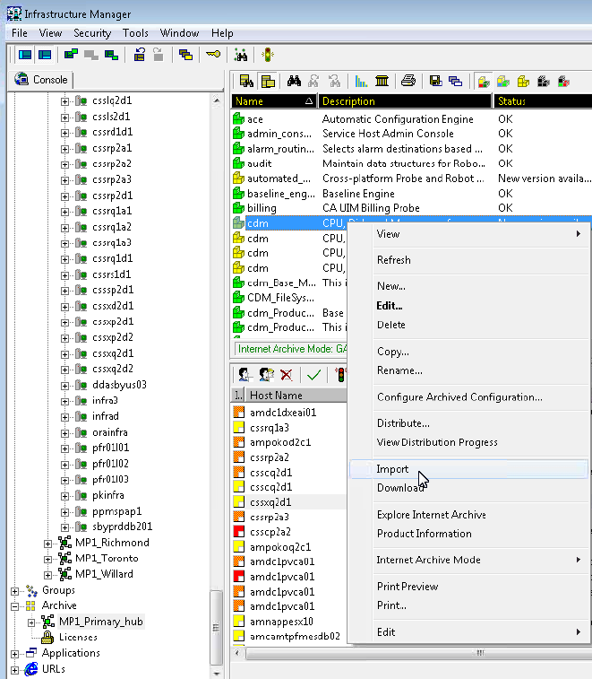
</kbd>

3. Browse to the xmattersgtw_1.14.zip
4. Click Open

### Updating xmattersgtw_1.14 Package with customized Jar File

1. Go into Archive
2. Locate the xmattersgtw package that was installed perviously
3. Double click on xmattersgtw package
4. Remove xmattersgtw.jar file
  1. Go to the Files Tab and locate the xmattersgtw.jar file.
  2. Right click on the xmattersgtw.jar file and go to Remove file
  3. Click OK to confirm remove

<kbd>
	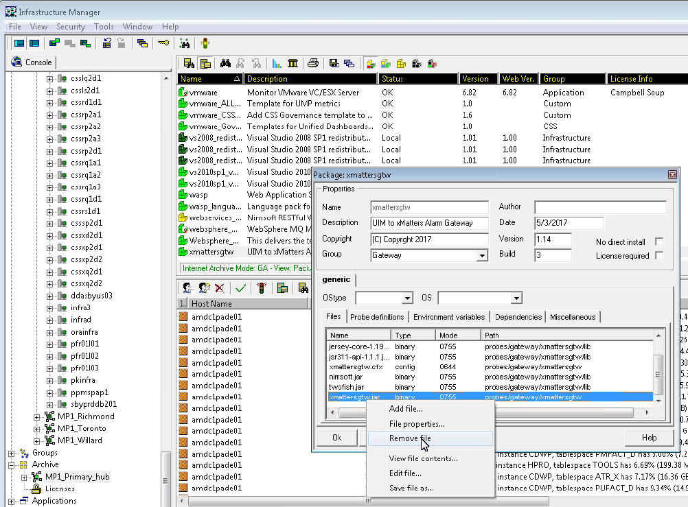
</kbd>

5. Right click anywhere in the Files Tab and go to Add File...

<kbd>
	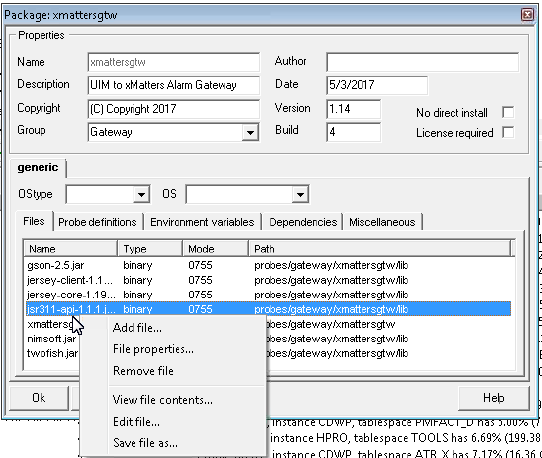
</kbd>

6. Click Browse

<kbd>
	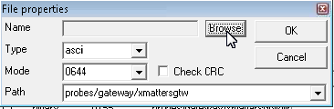
</kbd>

7. Select the updated xmattersgtw.jar file.
8. Click OK
9. Click Ok again.
10. Confirm that the new file has been added to the package.
11. Click OK.


### Deploying the xMattersgtw probe

There are two ways to deploy a probe.

#### Drag and drop the probe from the Archive to a domain/hub/robot

<kbd>
	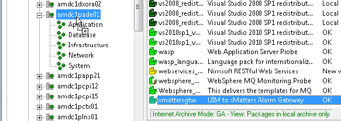
</kbd>

#### Distribute the probe as instructed below.

1. Select xmattersgtw package in the archive.
2. Right-click and select Distribute from the menu. A Distribute dialog box appears.

<kbd>
	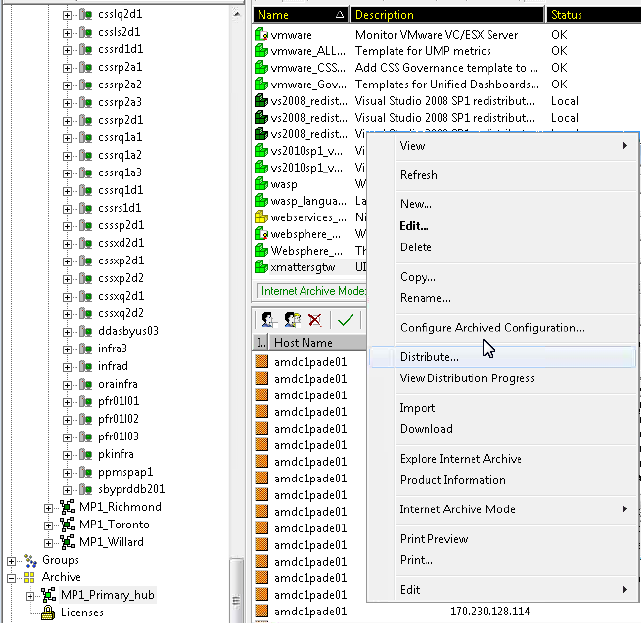
</kbd>

3. Select the domain/hub/robot where you want to distribute the package, and click the Add button. The domain/hub/robot name appears in the right column.
4. Click OK. A View Distribution Progress dialog box appears with detailed information about the distribution. *Note*: You can minimize this dialog box and continue working in Infrastructure Manager without interfering with the distribution.

<kbd>
	
</kbd>

5. Click the Close Dialog button after distribution is finished. 


### Configuring the xmattersgtw probe

1. Navigate to the domain/hub/robot where you deployed the xmattersgtw probe.
2. Right click on xmattersgtw probe and go to Raw Configure...

<kbd>
	
</kbd>

3. Set the following values:

You will get the values for this step after you have configured and installed the UIM - Nimsoft xMatters Communication Plan. You will do this later in this guide and instructions can be found here. LINKME

*xmattersurl* = This is the url of the Inbound Integration for the Nimsoft xMatters Communication plan. 
*logfile* = xmattersftw.log
*loglevel* = Set how detailed you want the log to be. 1 = Very few logs, 5 : The most logs, debug.
*cmattersuser* = uim_api
*xmattespassword* = The password for uim_api user created in xMatters.

4. Click OK
5. Right clik on xmattersgtw probe and go to Activate. 

### Setting up an alarm repost with subject of xmatters

The xMatters probe is set to sit on your UIM message bus and listen for any message with a subject of "xmatters".

When a event with a subject of "xmatters" is found, the xmatters probe will execute the xmattersgtw.jar file and do an api call to send UIM fields over to xMatters.

The Nimsoft Alarm Server processes all alarms.


1. Go to your domain/hub/robot that you previously installed the xMatters probe.
2. Locate the probe named nas (Nimsoft Alarm Server)

<kbd>
	
</kbd>

3. Double click on the nas probe.
4. Go to Auto-Operator tab and then to the Profiles tab.
5. Right click anywhere in the list and go to New.

<kbd>
	
</kbd>

6. Configure the New Profile as follows:

*Action Type*: repost
*Subject*: xmatters (must be all lowercase)
*Action mode*: On message arrival (or at another interval if your use case requires)
*Matching Criteria*: Set your criteria for what messages you want to create a repost on and send to xMatters. Remember the xMatters probe is looking for this repost and when it finds it, the event will be sent to xMatters.


For more information go [here](https://docops.ca.com/ca-unified-infrastructure-management-probes/ga/en/alphabetical-probe-articles/nas-alarm-server/nas-versions-4-4-4-7/v4-6-nas-im-configuration/the-auto-operator-tab-v4-6#TheAuto-OperatorTabv4.6-ProfileAdvanced).

<kbd>
	
</kbd>


## Installing xMatters Integration Agent

Follow instructions located [here](https://support.xmatters.com/hc/en-us/articles/202004275). 

Once you have  installed the xMatters Integration Agent and it is successfully communicating with xMatters you can go on to the next steps below.

### Correcting UIM callback logging error

1. Open the xMatters integration agent script `/lib/integrationservices/javascript/xmio.js`
2. Change line 104 to 109 from this:

```javascript
var response = {};
      response.status = resp.getStatusLine().getStatusCode();
      response.body = XMIO.http.getResponseAsString(resp);
      XMIO.http.releaseConnection(resp);
      IALOG.info("\t\tReceived response code: {0} and payload: {1}", response.status,  response.body);
      return response;
```


To:

```javascript
var response = {};
response.status = resp.getStatusLine().getStatusCode();

if (method !== 'PUT') {
    response.body = XMIO.http.getResponseAsString(resp);
    XMIO.http.releaseConnection(resp);
    IALOG.info("\t\tReceived response code: {0} and payload: {1}", response.status, response.body);
}
else {
    XMIO.http.releaseConnection(resp);
    IALOG.info("\t\tReceived response code: {0}", response.status);
}    
return response;
```

## Set up UIM Integration Service in the IA

### Add UIM Integration Service to Integration Agent

Extract the contents of UIM-xMatters-Event-Domain.zip into the following Integration Agent Directory.

`<IA-Home>\integrationservices\applications\`

The directory structure should become: `<IA-Home>\integrationservices\applications\uim\`
 
### Edit the configuration.js file

1. Navigate to the directory `<IA-Home>\integrationservices\applications\uim`
2. Open `configuration.js`
3. Edit the following lines. These lines are part of the UIM Put API path in uim.js file.
  1. *Line 15*: `UIM_PROTOCOL = "http";`
  2. *Line 16*: `UIM_SERVER = "amdc1pxm02";`
  3. The following is the default path for UIM Put API:
  `UIM_PROTOCOL + "://" + UIM_SERVER + "/rest/alarms/" + msg.additionalTokens.alarmID + "/assign/"`
4. And these lines. These are for Authenticating the Put API into UIM system. 
  1. *Line 19*: `UIM_USER = "xmatters";`
  2. *Line 20*: `UIM_SERVER = "password";`
  3. A user in UIM must exist with the user ID and password set in these lines. 
  4. This user must have permission to make web service calls into UIM.
5. Save and close `configuration.js`.


## Add new Integration Service reference to the Integration Agent

Navigate to the directory <IA-Home>\conf\

Open IAConfig.xml

Scroll down to around line 330 and look for the code:

<service-configs dir="../integrationservices">
  <!--
| 0 or more paths (relative to <services-configs>/@dir), that refer to
| the Service Config files that this IA will load whenever it is started or
| the "iadmin reload all" command is issued.
|
| NOTE: Paths may be Unix or Windows-formatted, although it is
| recommended that Unix-formatting be used since it works under both environments.
|
| NOTE: Depending on the OS, paths may be case-sensitive.
-->

Add the following path just before </service-configs>:

<path>applications/uim/uim.xml</path>


Save IAConfig.xml

Close  IAConfig.xml


   
# Testing
Be specific. What should happen to make sure this code works? What would a user expect to see?

# Troubleshooting
Optional section for how to troubleshoot. Especially anything in the source application that an xMatters developer might not know about. 

# Customizing
This section details how to make changes to the UIM Probe or to send fields to xMatters that are not part of the Out of Box UIM Probe.

## Pre-steps
1. Install an application that can extract Jar files such as: Winzip or Unarchiver
2. Check what version of Java you have installed. For instructions go [here](https://www.java.com/en/download/help/version_manual.xml#jcpl).
3. If you have Java 8 or higher: Go to step 4
4. If your version of Java is older than Java 8:  Install Java 8+ from the link below.
[Java SE Development Kit](http://www.oracle.com/technetwork/java/javase/downloads/jdk8-downloads-2133151.html)
5. Install Eclipse by downloading here: [Eclipse IDE for Java Developers](http://www.eclipse.org/downloads/packages/eclipse-ide-java-developers/neon3)


## Import Eclipse project
### First time running Eclipse
1. Open Eclipse.
2. Follow the prompts to create a new workspace. This is where all Eclipse projects will be stored. 
3. After Creating a new Workspace you will be taken the the welcome screen shown below.
4. Click Import existing projects.

<kbd>
	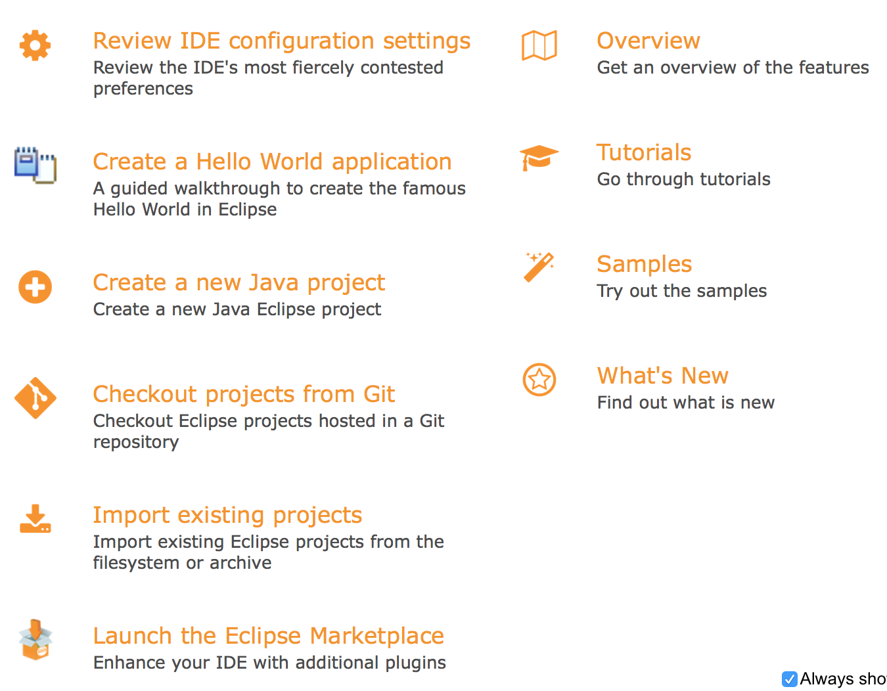
</kbd>

5. Check Select archive File radio button.
6. Browse and select xmattersgtw-Eclipse-Archive.zip file.
7. Ensure *xMatters_UIM (xMatters_UIM/)* project is selected.

<kbd>
	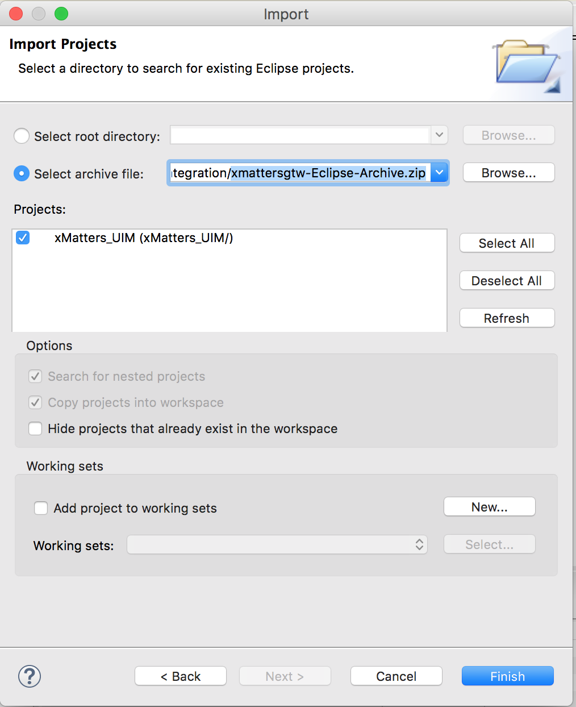
</kbd>

8. Click Finish.


### Using an existing Workspace
1. Open Eclipse.
2. Select an existing Workspace or create a New Workspace.
3. File -> Import.
4. Expand General Folder, Select Existing Project into Workspace and click Next.

<kbd>
	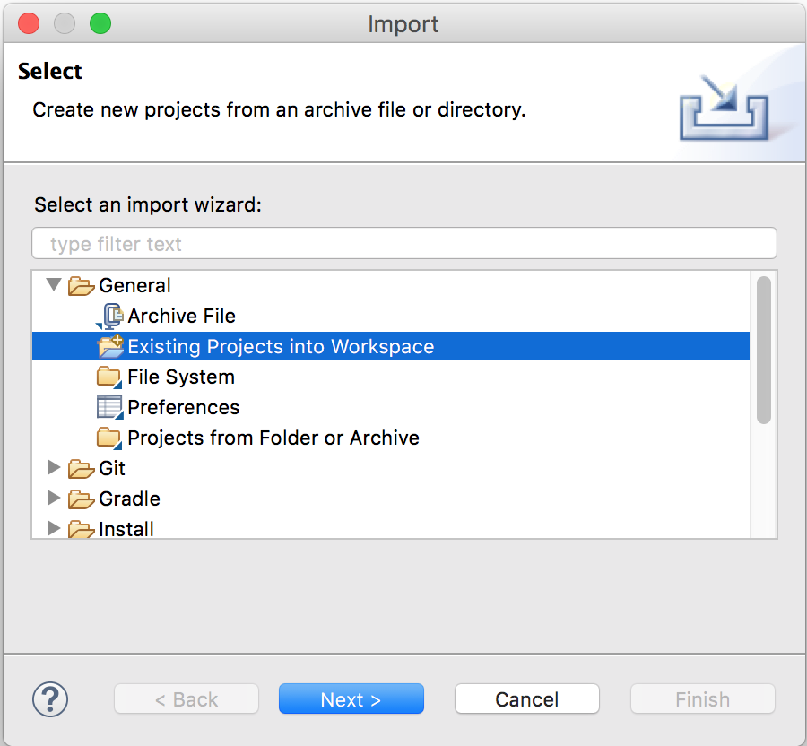
</kbd>

5. Check Select archive File radio button.
6. Browse and select [xmattersgtw-Eclipse-Archive.zip](xmattersgtw-Eclipse-Archive.zip) file.
7. Ensure xMatters_UIM (xMatters_UIM/) project is selected.

<kbd>
	
</kbd>

8. Click Finish.

## Modifying Java files

Locate the Java files by expanding the following items in your Eclipse Project and double clicking on the Java file.

xMatters_UIM -> src -> com.uim.field.xmattersgtw -> XMattersAlarmTemplate.java
xMatters_UIM -> src -> com.uim.field.xmattersgtw -> XMattersGtw.java

<kdb>
	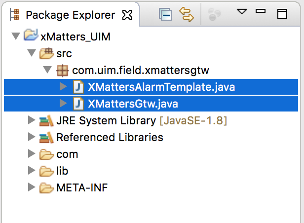
</kbd>

### Modifying XMattersAlarmTemplate.java

?????????????

### Modifying XMattersGtw.java

?????????????


## Packaging a New Jar File

If you have made a change to a java file, you will need to create a new Jar file in Eclipse. The following process will walk you through this.

1. Make sure your project is saved. 
2. Close all open file editing windows with Java or Manifest files. Leaving these open can cause compiling to fail.
3. Start The export process. File -> Export

<kbd>
	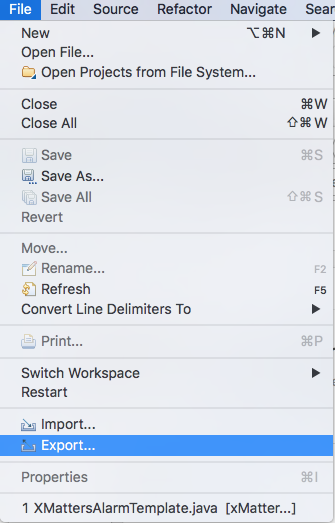
</kbd>

4. Expand Java Folder, Select JAR file and click Next.
5. Select the following resources to export:
*Select:*
- [x] src
- [x] src -> com.uim.field.xmattersgtw
- [x] src -> com.uim.field.xmattersgtw ->XMattersAlarmTemplate.java
- [x] src -> com.uim.field.xmattersgtw ->XMattersGtw.java

*Do Not Select:*
- [ ] .settings
- [ ] com
- [ ] lib
- [ ] META-INF

<kbd>
	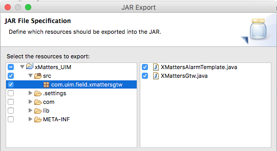
</kbd>

6. Ensure the following Export Settings are Checked / Unchecked

<kbd>
	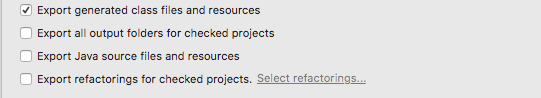
</kbd>

7. Select the export destiation by clicking Browse. Give the file the following name: xmattersgtw.jar

<kbd>
	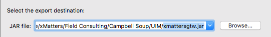
</kbd>

8. Ensure the following options are Cheked/ Unchecked:

<kbd>
	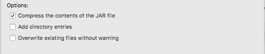
</kbd>

9. Click Next >. *Do not click finish!*
10. Ensure the following are checked:
-[x] Export class files with compile errors
-[x] Export class files with compile warnings

<kbd>
	
</kbd>

11. Click Next >. *Do not click finish!*
12. Select *Use existing manifest from workspace* and browse to the following file:

<kbd>
	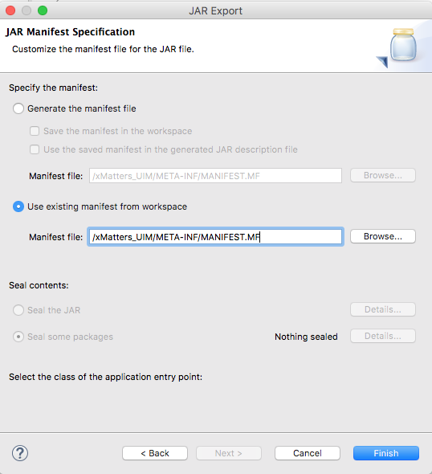
</kbd>

13. Expand *META-INF* folder, select the *MANIFEST.MF* file and click Ok. 

<kbd>
	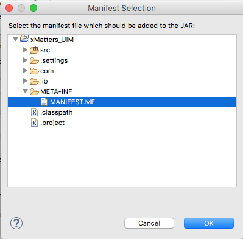
</kbd>

14. Click *Finish*.


## Troubleshooting Typical Eclipse / UIM Errors 

If you are getting errors when compiling your jar package in eclipse try the following.


*Errors about the Build Path try the following:*

- Project => Clean
- File => Refresh
- Close all open files in Eclipse, try to export jar again.
- Check your Build Path:
  1. Right Click xMatters_UIM go to Properties
  1. Double Click Java Build Path
  1. Click on Sources Tab
  1. Ensure Default output folder is set to:  xMatters_UIM/com/uim/field/xmattersgtw
- File => Restart


*Errors about the version of Java when installing into UIM:*

Change the Java Compiler version in Eclipse:
1. Right Click xMatters_UIM go to Properties.
1. Double Click Java Compiler
1. Uncheck Use Compliance from execution environment
1. Change Compiler compliance level to appropriate version

